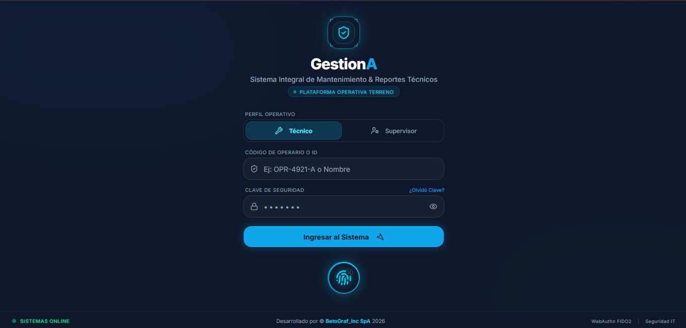
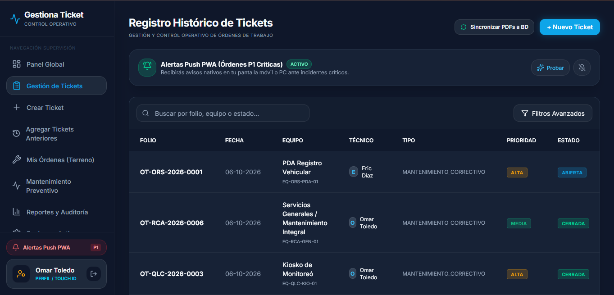
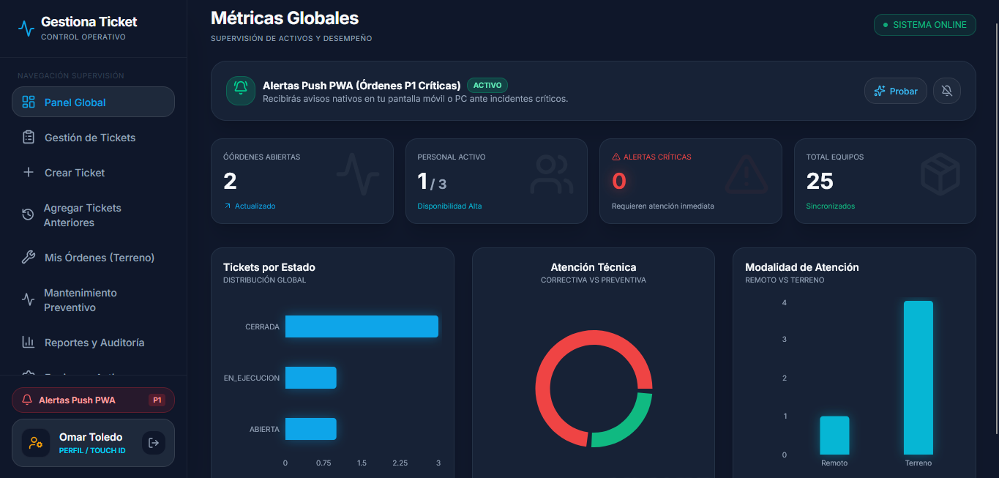

<div align="center">

  

  # GestionA™
  ### Sistema Integral de Mantenimiento Industrial, Control de Activos & CMMS de Misión Crítica
  
  **La plataforma de ingeniería operativa donde el tiempo de inactividad no es una opción.**

  <p align="center">
    Desarrollado y respaldado por <b>BetoGraf_Inc SpA</b> para corporaciones, plantas productivas, centros de distribución e infraestructuras críticas que exigen cero improvisación, trazabilidad legal absoluta y máxima eficiencia en terreno.
  </p>

  <!-- Badges Cyber-Industrial -->
  <p align="center">
    
    
    
    
    
  </p>

  <p align="center">
    <a href="#-visión-general--propuesta-de-valor">Visión General</a> •
    <a href="#-galería-visual-de-la-plataforma">Galería del Sistema</a> •
    <a href="#-los-7-pilares-de-excelencia-operacional">Pilares Técnicos</a> •
    <a href="#-retorno-de-inversión-roi-comprobado">Impacto y ROI</a> •
    <a href="#-arquitectura-y-seguridad-industrial">Arquitectura</a> •
    <a href="#-contacto-comercial--demostración-privada">Contacto Comercial</a>
  </p>

</div>

---

> [!IMPORTANT]
> **AVISO DE EXCLUSIVIDAD Y PROPIEDAD INTELECTUAL:**  
> **GestionA™** es una solución corporativa de software privativo diseñada para despliegues empresariales cerrados. **No se encuentra disponible para venta minorista masiva ni para acceso público abierto.** Este repositorio tiene fines estrictamente informativos, comerciales y de auditoría técnica. Por estrictos protocolos de ciberseguridad industrial, no se publican enlaces directos ni accesos a instancias de producción de clientes en operación.

---

## 🏭 Visión General & Propuesta de Valor

En el entorno industrial contemporáneo, una falla no atendida en una compuerta logística, un tótem de control de acceso, una subestación eléctrica o una línea de empaque puede generar **pérdidas de decenas de miles de dólares por hora**, cuellos de botella en la cadena de suministro y sanciones contractuales por incumplimiento de niveles de servicio (SLA).

La mayoría de las empresas intentan gestionar su mantenimiento a través de métodos fragmentados: planillas Excel desactualizadas, grupos de mensajería instantánea donde se pierden los requerimientos, o sistemas ERP genéricos excesivamente lentos y rígidos que los técnicos en terreno rechazan utilizar.

```
┌────────────────────────────────────────────────────────────────────────────────────────┐
│                                                                                        │
│   ❌ EL RIESGO TRADICIONAL                ➔   ⚡ LA SOLUCIÓN GESTIONA™                 │
│                                                                                        │
│   • Órdenes extraviadas en chats          ➔   • Folio correlativo oficial inmutable    │
│   • Pérdida de señal detiene al técnico    ➔   • Operación 100% Offline con IndexedDB   │
│   • Actas en papel ilegibles o perdidas   ➔   • PDF pericial inmediato con firmas      │
│   • Tiempos de respuesta imposibles de    ➔   • SLAs cronometrados al milisegundo      │
│     auditar ante la gerencia              ➔   • Visibilidad ejecutiva en tiempo real   │
│                                                                                        │
└────────────────────────────────────────────────────────────────────────────────────────┘
```

**GestionA™** transforma radicalmente este paradigma:
1. **Unifica el Mantenimiento Correctivo y Preventivo** bajo una única consola de control industrial.
2. **Empodera al técnico en terreno con una Progressive Web App (PWA) de alto rendimiento**, diseñada específicamente para smartphones y tablets de uso rudo.
3. **Garantiza trazabilidad pericial con respaldo legal:** cada orden finalizada genera automáticamente un Acta Técnica oficial en PDF con mosaico fotográfico de hasta 10 evidencias y doble firma digitalizada.

---

## 📸 Galería Visual de la Plataforma

A continuación se presentan capturas reales de la interfaz de **GestionA™**, ilustrando su sofisticada estética cyber-industrial en modo oscuro con acentos tácticos, optimizada para reducir la fatiga visual en turnos extensos y proporcionar contraste óptimo en exteriores.

---

### 1. Control de Acceso Blindado & Autenticación Biométrica 1-Touch
<div align="center">
  
  <p><em>Figura 1: Módulo de Acceso Unificado. Permite conmutar perfiles entre Técnico de Terreno y Supervisor. Incorpora autenticación criptográfica FIDO2/WebAuthn mediante huella dactilar física (Touch ID) y reconocimiento facial (Face ID) desacoplada de cuentas de terceros.</em></p>
</div>

* **Identificación Jerárquica:** Acceso segmentado por código de operario o correo institucional (`TECNICO`, `COORDINADOR`, `SUPERVISOR`, `SUPERADMIN`).
* **Protección Anti-Robo de Identidad:** Integración nativa de hardware con Secure Enclave / Android Keystore, garantizando que nadie pueda suplantar la firma o dictamen de un técnico.
* **Ergonomía Táctica:** Botón flotante biométrico calibrado para manipulación con el pulgar en dispositivos móviles de cualquier dimensión.

---

### 2. Gestión Operativa de Órdenes de Trabajo, SLAs y Alertas Push
<div align="center">
  
  <p><em>Figura 2: Consola de Supervisión y Registro Histórico. Visualización en tiempo real de folios oficiales (OT-ORS, OT-RCA, OT-QLC), estados del ciclo de vida, técnicos designados y canal de Alertas Push PWA P1 para emergencias operacionales.</em></p>
</div>

* **Nomenclatura Unificada por Planta:** Generación de folios estandarizados correlativos anuales por instalación (ej. `OT-QLC-2026-0001` para Planta Quilicura).
* **Canal Web Push PWA VAPID:** Despacho instantáneo de notificaciones nativas a la pantalla de bloqueo ante incidentes de prioridad crítica (`P1`).
* **Buscador Multicriterio:** Filtrado dinámico instantáneo por folio, activo, código de serie, técnico asignado o identificador de ticket externo (`ticketExterno` de sistemas heredados como GLPI o Jira).

---

### 3. Centro de Mando Ejecutivo & Métricas de Desempeño (KPIs)
<div align="center">
  
  <p><em>Figura 3: Panel Global de Telemetría Operativa. Cuadro de mando ejecutivo con conteo de órdenes activas, disponibilidad del personal, índice de criticidad y gráficos analíticos interactivos de distribución de carga.</em></p>
</div>

* **Monitoreo en Tiempo Real:** Visualización simultánea de cuadrillas activas, activos sincronizados y tiempo medio de respuesta (MTTR).
* **Distribución de Atención:** Segmentación gráfica entre Mantenimiento Preventivo vs. Correctivo y modalidad en Terreno vs. Remoto.
* **Transparencia para Auditorías:** Todos los datos se actualizan de forma reactiva reflejando la operación verídica de cada planta.

---

## ⚡ Los 7 Pilares de Excelencia Operacional

```
  ┌────────────────────────────────────────────────────────────────────────────────────────┐
  │                                                                                        │
  │   1. 🔄 Ciclo de Vida Pericial de 5 Estados (Abierta ➔ Cierre sin callejones)           │
  │   2. 🤝 Bandeja de Terreno con Toma Exclusiva de Órdenes Desatendidas                   │
  │   3. 📋 Mantenimiento Preventivo Estandarizado (Nomenclatura PNL-Prev-YYYY-0001)       │
  │   4. 📶 Operación 100% Offline-First en Subterráneos (IndexedDB + Background Sync)     │
  │   5. 📑 Generador Inmediato de Actas Técnicas PDF Oficiales con Firma Legal            │
  │   6. 🏷️ Rotulación de Activos QR de Alta Densidad y Escaneo por Cámara Nativa          │
  │   7. 🏛️ Módulo de Carga Histórica para Auditorías y Respaldo de Atenciones Previas     │
  │                                                                                        │
  └────────────────────────────────────────────────────────────────────────────────────────┘
```

### 1. 🔄 Ciclo de Vida Pericial de 5 Estados
A diferencia de sistemas rígidos que solo contemplan "Abierto" o "Cerrado", GestionA soporta la realidad técnica del terreno:
* `ABIERTA`: Requerimiento recibido y clasificado por criticidad (`P1-Crítica`, `P2-Alta`, `P3-Media/Baja`).
* `EN_DIAGNOSTICO`: El técnico interviene el equipo, documenta hallazgos y fija el tiempo de respuesta inicial.
* `EN_EJECUCION`: Trabajos mecánicos, eléctricos o de software en progreso con guardado continuo de bitácora.
* `PENDIENTE`: Estado seguro para requerimiento de repuestos o piezas sin obligar al cierre prematuro ni alterar negativamente el SLA de resolución.
* `CERRADA`: Cierre formal acreditado mediante protocolo de pruebas, evidencia fotográfica y firma de conformidad.

### 2. 🤝 Bandeja de Terreno con Autoasignación y Exclusividad
Cuando la administración o el motor cron generan órdenes preventivas sin un técnico designado, estas aparecen automáticamente en la sección *"Órdenes Disponibles para Tomar"* en la app móvil de todos los técnicos habilitados de la planta.
* **Autoasignación con 1 Clic:** Al presionar **"TOMAR ORDEN"**, el sistema autoasigna la tarea al técnico en sesión, transiciona a `EN_DIAGNOSTICO` y recalcula los tiempos.
* **Exclusividad Inmediata:** Desaparece al instante de la lista de órdenes disponibles de los demás técnicos para evitar duplicación de esfuerzos o confusiones en terreno.

### 3. 📋 Mantenimiento Preventivo Estandarizado (`PNL-Prev-YYYY-0001`)
* **Nomenclatura Homogénea:** Los planes preventivos siguen el estándar `PNL-Prev-[AÑO]-[CORRELATIVO 4 DÍGITOS]`.
* **Motor Recurrente Automático:** Agendamiento periódico (semanal, mensual, bimestral, semestral o anual) con ejecución autónoma vía cron sin intervención manual.
* **Checklist Pericial Guiado:** Wizard técnico estructurado en 5 etapas obligatorias:
  1. *Inspección Visual y Estructural de Cableado*
  2. *Limpieza Óptica y Despeje de Sensores*
  3. *Calibración y Ajuste de Mecanismos Móviles*
  4. *Prueba de Corte de Energía / Parada de Emergencia*
  5. *Dictamen Final de Operatividad*

### 4. 📶 Operación 100% Offline-First (Subterráneos y Búnkeres)
Las instalaciones industriales cuentan con túneles, cámaras subterráneas y naves apantalladas donde no penetra la señal móvil.
* **Almacenamiento Local `gestiona_offline_db`:** Los formularios, fotos y firmas se almacenan de manera transaccional e indestructible en el navegador del dispositivo mediante IndexedDB.
* **Background Sync:** Al volver a detectar cobertura celular (4G/5G/Wi-Fi), la plataforma sincroniza en segundo plano todos los avances, fotos y firmas sin requerir que el técnico reinicie la aplicación ni pierda datos.

### 5. 📑 Motor de Actas Técnicas PDF Oficiales
Cada ticket cerrado emite de forma autónoma un documento formal de ingeniería con validez jurídica y de auditoría:
* **Branding Corporativo Industrial:** Membrete oficial, fecha y hora exacta sincronizada con la zona horaria del equipo anfitrión.
* **Telemetría de Activo:** N° de Serie, Dirección IP de red, Tag físico, instalación y ubicación específica.
* **Mosaico Fotográfico:** Compresión inteligente de hasta 10 fotografías en alta resolución procesadas en servidor (`sharp`).
* **Doble Firma Acreditada:** Firma digital del técnico ejecutor + firma táctil del solicitante o jefe de planta con la leyenda oficial: `[ ✓ TRABAJO CONFORME Y RECEPCIONADO ]`.
* **Almacenamiento en la Nube:** Disponible para descarga instantánea mediante enlace seguro protegido.

### 6. 🏷️ Ecosistema QR Físico: Etiquetas y Escaneo por Smartphone
* **Generador de Etiquetas Autoadhesivas en Bloque:** Impresión para hojas carta, A4 y rollos térmicos con nomenclatura oficial `EQ-[SIGLA]-[TIPO]-[CORRELATIVO]`.
* **Lector QR por Cámara Nativa:** Los técnicos escanean la etiqueta física del equipo directamente con la cámara de su smartphone para acceder a la hoja de vida del activo, su historial de fallas y reportar incidencias en menos de 5 segundos.

### 7. 🏛️ Módulo de Tickets Anteriores e Históricos
Diseñado para procesos de migración desde planillas Excel, sistemas legados o auditorías externas que exigen respaldo retroactivo:
* **Respeto de Fechas Históricas:** Permite registrar solicitudes y cierres con fechas pasadas (ej. 2023, 2024, 2025).
* **Folio con Año Histórico:** La orden adopta el año verídico del evento (ej. `OT-ORS-2024-0001`).
* **Cálculo SLA Retroactivo:** Tiempo de respuesta e intervención cronometrados con precisión histórica.
* **Generación Inmediata de Informe:** Crea el Acta Técnica en PDF al instante para responder a requerimientos de auditores o clientes.

---

## 📈 Retorno de Inversión (ROI) Comprobado

La implementación de **GestionA™** entrega resultados cuantitativos medibles desde el primer mes de despliegue en plantas operativas:

| Métrica de Desempeño | Operación Tradicional | Con GestionA™ | Beneficio Empresarial |
| :--- | :---: | :---: | :--- |
| **Tiempo Medio de Reparación (MTTR)** | 4.8 horas | **1.8 horas** | ⚡ **Reducción de 62.5%** en tiempos de detención |
| **Pérdida o Extravío de Solicitudes** | 12% a 18% | **0.0%** | 🛡️ **Trazabilidad digital total** |
| **Emisión y Firma de Informe Técnico** | 2 a 5 días | **Instantáneo (0 min)** | 📑 **Acta generada al cerrar la OT** |
| **Cumplimiento de Preventivos** | 64% | **98.4%** | 🔧 **Aumento de vida útil de activos (+35%)** |
| **Riesgo Legal / Pérdida de Garantías** | Elevado | **Mitigado al 100%** | ⚖️ **Auditoría inmutable con evidencia fotográfica** |

---

## 🛡️ Arquitectura y Seguridad Industrial

GestionA™ está construido sobre los estándares más exigentes de la ingeniería de software moderna:

```
[ Cliente Móvil / Desktop PWA ]
       │
       ▼  (HTTPS / TLS 1.3 + FIDO2 WebAuthn Hardware Keys)
[ Edge Proxy & Security Layer ]
       │
       ├─ Next.js 16 App Router (React Server Components + Server Actions)
       ├─ Serwist Service Worker (Cache Industrial & Background Sync)
       ├─ Motor de Renderizado PDF Serverless (Sharp + React-PDF)
       ├─ Web Push Protocol (RFC 8291 / VAPID Keys)
       │
       ▼  (Prisma ORM Cifrado con Connection Pooling)
[ PostgreSQL Enterprise Supabase ] ──► [ Bucket de Evidencias Cifrado ]
```

* **Control de Acceso Basado en Roles (RBAC):** Separación estricta de privilegios (`SUPERADMIN`, `SUPERVISOR`, `COORDINADOR`, `TECNICO`) validada mediante esquemas en cada Server Action.
* **Criptografía FIDO2 / WebAuthn:** Claves públicas asimétricas almacenadas en hardware local sin contraseñas compartidas ni vulnerabilidad ante phishing.
* **Blindaje Client-Side en Terreno:** Prevención de desbordes de viewport (100dvh), bloqueo de atajos de teclado destructivos y optimización táctil.

---

## 💼 Modalidades de Implementación Corporativa

GestionA™ se despliega exclusivamente bajo acuerdos corporativos personalizados para empresas de mantenimiento, seguridad electrónica, centros logísticos y plantas productivas:

1. **Modalidad On-Premise / Nube Privada:** Despliegue en infraestructura dedicada del cliente (AWS, Azure, Google Cloud o servidores locales de planta).
2. **Modalidad SaaS Privado Gestionado:** Entorno completamente administrado y securizado por el equipo de ingeniería de **BetoGraf_Inc SpA**, con soporte 24/7 y respaldos continuos.
3. **Servicio Llave en Mano:**
   - Levantamiento inicial y carga masiva del inventario de activos.
   - Rotulación física de planta con etiquetas QR de alta resistencia.
   - Configuración de plantas, cuadrillas y SLAs contractuales.
   - Capacitación técnica presencial a supervisores y cuadrillas de terreno.

---

## 📞 Contacto Comercial & Demostración Privada

Si su organización requiere modernizar sus procesos de mantenimiento, auditar el desempeño de sus contratistas y garantizar la continuidad operacional de sus activos:

<div align="center">

### 🏢 BetoGraf_Inc SpA
**Programación - Desarrollo web y servicios tecnologicos Toledos SpA**  
Santiago de Chile

[](https://wa.me/56933445244?text=Hola,%20solicito%20una%20demostración%20comercial%20privada%20de%20la%20plataforma%20GestionA)
[](https://betograf.cl)

📧 **Contacto Directo:** [contacto@betograf.cl](mailto:contacto@betograf.cl)  
📱 **Mesa de Ayuda Ejecutiva:** [+56 9 33445244](https://wa.me/56933445244)

</div>

---

<div align="center">
  <sub>© 2026 <b>BetoGraf_Inc SpA</b>. Todos los derechos reservados. GestionA™ es una marca y software privativo de BetoGraf_Inc SpA. Prohibida su reproducción, ingeniería inversa o distribución no autorizada.</sub>
</div>
